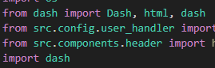

  
César Chirino

  
Repo Evaluation

---- 

### Table of content
- ##### [Introducción](#)
  - [Propósito General del Código](#)
  - [Contexto y Tecnologías Utilizadas](#)
- ##### [Análisis del código](#)
  - [Estructura general](#)
  - [Análisis detallado de funciones/métodos](#)
- ##### [Conclusiones y recomendaciones](#)

----
### **Introducción** 

**Propósito General del Código** 

Este proyecto es una aplicación web diseñada en Dash, una biblioteca de Python que facilita la creación de interfaces web interactivas y visualizaciones de datos. El propósito principal del código es proporcionar una interfaz interactiva que permita a los usuarios acceder, analizar y visualizar datos provenientes de varias fuentes, como bases de datos de Azure (CosmosDB, Data Lake) y Databricks.

La aplicación está orientada hacia el manejo y análisis de grandes volúmenes de datos en tiempo real, asegurando que los usuarios puedan realizar consultas complejas, obtener resultados rápidamente y visualizar esos resultados de manera efectiva en la interfaz de Dash. Además, el código está diseñado para integrarse de manera eficiente con la infraestructura existente en la nube, facilitando la escalabilidad y el manejo de datos distribuidos.

**Contexto y Tecnologías Utilizadas**  

El proyecto opera dentro de un ecosistema de aplicaciones y servicios que manejan datos críticos para la toma de decisiones en un entorno empresarial. A continuación, se describe el contexto y las tecnologías clave utilizadas en el proyecto:

- **Dash:**

    - **Propósito:** Dash es la herramienta principal utilizada para construir la interfaz de usuario de la aplicación, manejada con diferentes páginas. Facilita la creación de gráficos, tablas y otros elementos interactivos que permiten a los usuarios explorar los datos de manera intuitiva.
  
    - **Uso en el proyecto:** La aplicación está diseñada para proporcionar visualizaciones interactivas que facilitan la comprensión de los datos, distribuidas en diversas páginas. Dash utiliza un sistema de callbacks para actualizar los elementos de la interfaz en respuesta a las acciones del usuario, lo que facilita una experiencia dinámica y receptiva.

- **Azure CosmosDB:**

    - **Propósito:** CosmosDB es una base de datos NoSQL altamente escalable de Microsoft Azure. Se utiliza para almacenar y consultar grandes volúmenes de datos estructurados.
    - **Uso en el proyecto:** El archivo cosmosdb_conn.py muestra cómo se configura y utiliza CosmosDB para realizar consultas de datos basadas en un rango de tiempo y ciertos criterios de filtrado. Esto es esencial para manejar grandes volúmenes de datos históricos y obtener insights específicos basados en etiquetas o identificadores de datos.

- **Azure Data Lake:**

    - **Propósito:** Azure Data Lake es un servicio de almacenamiento de datos optimizado para análisis a gran escala. Permite almacenar datos en su forma nativa, escalar la capacidad de almacenamiento y procesamiento, y asegurar el acceso eficiente a estos datos.
    - **Uso en el proyecto:** El archivo datalake_conn.py ilustra cómo se establece una conexión con el servicio de Data Lake y cómo se verifica la disponibilidad del servicio. Esto es crucial para asegurar que los datos almacenados en Data Lake estén disponibles para análisis y procesamiento.

- **Databricks:**

    - **Propósito:** Databricks es una plataforma de análisis de datos que unifica la ingeniería de datos y la ciencia de datos. Facilita el procesamiento de grandes volúmenes de datos a través de Apache Spark.
    - **Uso en el proyecto:** En databricks_conn.py, el código establece una conexión con Databricks y permite ejecutar consultas SQL para obtener datos específicos. Esto es vital para realizar análisis avanzados y aprovechar la capacidad de procesamiento distribuido de Databricks.

- **Otras Tecnologías destacadas:**
  - MSAL (Microsoft Authentication Library)
  - OAuthlib (oauthlib)
  - Azure Blob Storage
  - PyArrow 
  - Pandas
  - Numpy 
  - Matplotlib 

----
### **Análisis del código** 

**Estructura General** 

|| Aqui va el dibujito o lo sacado de windows

**Análisis detallado de funciones/métodos**
|| Analisis de cada función

- ####  Root
  1. **setup.py**
      - *Funcionabilidad:* Este archivo define el script de instalación para el paquete Python usando `setuptools`.Especifica el nombre del paquete, la versión, la descripción, el autor y la licencia.
      - *Mejoras:* Pensando en escalabilidad se podría agregar el metadato install_requires y usar pip_tools para mantener actualizadas tanto setup cómo requirements.txt. Además se podría agregar un `long_description_content_type='text/markdown'`
  2. **requirements.txt**
      - *Funcionabilidad:* Lista las dependencias del proyecto junto con sus versiones específicas.
  3. **README.md**
      - *Funcionabilidad:* Proporciona una introducción al proyecto, guías de instalación, pruebas y contribución.
      - *Mejoras:* El README está vacío en su mayoría. Para mejorar la escalabilidad y reutilización del código, este archivo debe ser más detallado, explicando claramente el propósito del proyecto, cómo configurarlo, y cómo contribuir.
  4. **Procfile**
      - *Funcionabilidad:* Define comandos específicos para la ejecución en producción, como la instalación de dependencias y la ejecución del servidor con Gunicorn.
      - *Mejoras:* El `Procfile` está diseñado para definir los comandos que se deben ejecutar para poner en marcha las aplicaciones o servicios en producción no en gestionar instalaciones de dependencias del sistema, esto debe hacerse antes de que la aplicación se ejecute, si se incluye aquí estaríamos verificando esta instalación cada que la aplicación inice es ineficiente. Las instalaciones se pueden manejar con un script o un Dockerfile, o en este caso en el `Makefile`.
  5. **MakeFile**
      - *Funcionabilidad:* Define un conjunto de comandos para automatizar tareas como la instalación de dependencias, limpieza de archivos temporales, operaciones con Git, y otros.
      - *Mejoras:* Considerar agregar vrificaciones de entorno, para asegurar que por ejemplo Python esté instalado y su versión. Se podrían parametrizar algunos comandos, cómo la versión de Python.
  6. **constants.py**
      - *Funcionabilidad:* Define constantes relacionadas con la base de datos y carga variables de entorno desde un archivo .env.
      - *Mejoras:* Validación para asegurarse que las variables de entorno críticas están bien definidas. Agrupar las configuraciones sobre las bases de datos en una clase o diccionario para facilitar gestión y escalabilidad.
  7.  **main.py**
      - *Funcionabilidad:* Este archivo configura y ejecuta una aplicación Flask, integrando también el módulo DASH.
      - *Mejoras:* Eliminar importaciones que no se utilicen . Agregar documentación a cada sección del código. Manejar excepciones al cargar las configuraciones críticas para que la aplicación falle en forma controlada si algo va mal.
- #### src
  - **assets**
    1. css:
       - *Funcionabilidad:* Contiene archivos de hojas de estilo en cascada (CSS) que se utilizan para aplicar estilos a la aplicación Dash.
    2. img: 
        - *Funcionabilidad:* Contiene imágenes que se utilizan en la aplicación.
    3. logos:
       - *Funcionabilidad:* Contiene archivos de logo e iconos que se utilizan en la aplicación.
  - **callbacks**
    1. callbacks_autogestion.py
       - *Funcionabilidad:* ``update_dropdown_options_list`` Actualiza las opciones de los dropdows basandose en los KPI seleccionados. ``download_data`` Permite descargar los datos filtrados según los criterios seleccionados (niveles, KPI, tipo de dato, y rango de fechas). ``show_table`` Muestra una tabla de datos filtrada según los criterios seleccionados. ``update_line_chart``. Muestra un gráfico de líneas basado en los filtros seleccionados.
       - *Mejoras:* Documentación. Eliminar importaciones no utilizadas. Existe mucho código repetido en la función se pueden crear funciones auxiliares para manejar tareas comunes.  

    2. callbacks_recorded.py
       - *Funcionabilidad:* ``download_data_recorded``.Actualiza las opciones de los dropdowns para niveles y tipos de datos basándose en el KPI seleccionado. ``download_data_recordeds`` Permite descargar los datos filtrados según los criterios seleccionados. ``show_table_recorded`` Muestra una tabla de datos filtrada según los criterios seleccionados. 
       - *Mejoras:* Documentación. Eliminar importaciones no utilizadas.
  
    3. callbacks.py
       - *Funcionabilidad:* Centraliza las llamadas de los callbacks

  - **components**
  - - **plots**     
        1. brandline.py
           - *Funcionabilidad:*
           - *Mejoras:*   
        2. minaplots_medio_ambiente.py
           - *Funcionabilidad:*
           - *Mejoras:*
        3. minaplots_seguridad.py
           - *Funcionabilidad:*
           - *Mejoras:*
        4. minaplots.py
           - *Funcionabilidad:*
           - *Mejoras:*
    1. api_adls.py
       - *Funcionabilidad:*
       - *Mejoras:*
    2. archivero_comp.py
       - *Funcionabilidad:*
       - *Mejoras:*
    3. catalogo.py
       - *Funcionabilidad:*
       - *Mejoras:*
    4. data.py
       - *Funcionabilidad:*
       - *Mejoras:*
    5. datepicker.py
       - *Funcionabilidad:*
       - *Mejoras:*
    6. footer.py
       - *Funcionabilidad:*
       - *Mejoras:*
    7. get_log_user_data.py
       - *Funcionabilidad:*
       - *Mejoras:*
    8. get_timestamp.py
       - *Funcionabilidad:*
       - *Mejoras:*
    9. header.py
       - *Funcionabilidad:*
       - *Mejoras:*
    10. home.py
       - *Funcionabilidad:*
       - *Mejoras:*
    11. indicadores_generales_comp.py
       - *Funcionabilidad:*
       - *Mejoras:*
    12. navbar_indicadores_old.py
       - *Funcionabilidad:*
       - *Mejoras:*
    13. navbar_indicadores.py
       - *Funcionabilidad:*
       - *Mejoras:*
    14. navbar_reporte.py
       - *Funcionabilidad:*
       - *Mejoras:*
    15. navbar.py
       - *Funcionabilidad:*
       - *Mejoras:*
    16. portada.py
       - *Funcionabilidad:*
       - *Mejoras:*
    17. powerbi.py
       - *Funcionabilidad:*
       - *Mejoras:*
    18. resumen_ejecutivo.py
       - *Funcionabilidad:*
       - *Mejoras:*
    19. sidebar.py
       - *Funcionabilidad:*
       - *Mejoras:*
    20. tabla.py
       - *Funcionabilidad:*
       - *Mejoras:*
  - **config**
    1. app_config.py
       - *Funcionabilidad:*
       - *Mejoras:*
    2. routes.py
       - *Funcionabilidad:*
       - *Mejoras:*
    3. user_handler.py
       - *Funcionabilidad:*
       - *Mejoras:*
   
  - **databases**
    1. db_autogestion_recorded.py
       - *Funcionabilidad:*
       - *Mejoras:*
    2. db_catalogo.py
       - *Funcionabilidad:*
       - *Mejoras:*
    3. db_demo_table.py
       - *Funcionabilidad:*
       - *Mejoras:*
    4. db_indicadorees.py
       - *Funcionabilidad:*
       - *Mejoras:*
    5. db_kpi.py
       - *Funcionabilidad:*
       - *Mejoras:*
    6. db_portada.py
       - *Funcionabilidad:*
       - *Mejoras:*
    7. db_resumen_ejecutivo.py 
       - *Funcionabilidad:*
       - *Mejoras:*
  - **pages**
    1. arbol.py
       - *Funcionabilidad:*
       - *Mejoras:*
    2. archivos.py
       - *Funcionabilidad:*
       - *Mejoras:*
    3. catalogo.py
       - *Funcionabilidad:*
       - *Mejoras:*
    4. concentradora.py
          - *Funcionabilidad:*
          - *Mejoras:*
    5. datos_graficos.py
          - *Funcionabilidad:*
          - *Mejoras:*
    6. datos_kpi.py
          - *Funcionabilidad:*
          - *Mejoras:*
    7. datos_pi.py
          - *Funcionabilidad:*
          - *Mejoras:*
    8. demo_powerbi.py
          - *Funcionabilidad:*
          - *Mejoras:*
    9.  demo.py
           - *Funcionabilidad:*
           - *Mejoras:*
    10. home.py
           - *Funcionabilidad:*
           - *Mejoras:*
    11. indicadores_generales.py
           - *Funcionabilidad:*
           - *Mejoras:*
    12. mina.py
           - *Funcionabilidad:*
           - *Mejoras:*
    13. portada.py
           - *Funcionabilidad:*
           - *Mejoras:*
    14. puerto.py
           - *Funcionabilidad:*
           - *Mejoras:*
    15. recursos_hidricos.py
           - *Funcionabilidad:*
           - *Mejoras:*
    16. report_em_ml_informe_semanal.py
           - *Funcionabilidad:*
           - *Mejoras:*
    17. report_em_rs_one_room.py
           - *Funcionabilidad:*
           - *Mejoras:*
    18. report_em_rs.py
           - *Funcionabilidad:*
           - *Mejoras:*
    19. report_em_rs7x7diaria.py
           - *Funcionabilidad:*
           - *Mejoras:*
    20. report_em_rs7x7pr.py
           - *Funcionabilidad:*
           - *Mejoras:*
    21. reportes.py
           - *Funcionabilidad:*
           - *Mejoras:*
    22. tft.py
           - *Funcionabilidad:*
           - *Mejoras:*
    
  - **utils**
    1. utils.py
       - *Funcionabilidad:*
       - *Mejoras:*
    
  - - **api**
      1. dl_api.py
          - *Funcionabilidad:*
          - *Mejoras:*
  - - - **connectors**
        1. cosmos_db_conn.py
            - *Funcionabilidad:*
            - *Mejoras:*
        2. databricks_conn.py
            - *Funcionabilidad:*
            - *Mejoras:*
        3. datalake_conn.py
            - *Funcionabilidad:*
            - *Mejoras:*
        4. piwebapi_conn.py
            - *Funcionabilidad:*
            - *Mejoras:*
  - - **commands**
      1. get_wheels.py
          - *Funcionabilidad:*
          - *Mejoras:* 
  1. app.py
   - *Funcionabilidad:* Se encarga de configurar y lanzar la aplicación Dash dentro de un servidor Flask. Define las rutas y las hojas de estilo externas que se usarán en la aplicación. Se asegura de que las rutas estén protegidas mediante la función``login_required``.
   - *Mejoras:* Eliminar importaciones repetidas es redundante . Eliminar importaicones no utilizadas. Manejar posibles excepciones o errores en ``login_required``. Agregar documentación.

----

----

----