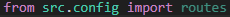
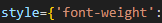
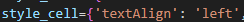
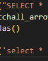
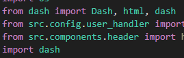
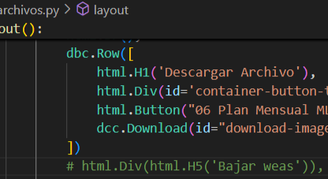

  
César Chirino

  
Repo Evaluation

---- 

### Table of content
- ##### [Introducción](#)
  - [Propósito General del Código](#)
  - [Contexto y Tecnologías Utilizadas](#)
- ##### [Análisis del código](#)
  - [Estructura general](#)
  - [Análisis detallado de funciones/métodos](#)
- ##### [Recomendaciones](#)

----
### **Introducción** 

**Propósito General del Código** 

Este proyecto es una aplicación web diseñada en Dash, una biblioteca de Python que facilita la creación de interfaces web interactivas y visualizaciones de datos. El propósito principal del código es proporcionar una interfaz interactiva que permita a los usuarios acceder, analizar y visualizar datos provenientes de varias fuentes, como bases de datos de Azure (CosmosDB, Data Lake) y Databricks.

La aplicación está orientada hacia el manejo y análisis de grandes volúmenes de datos en tiempo real, asegurando que los usuarios puedan realizar consultas complejas, obtener resultados rápidamente y visualizar esos resultados de manera efectiva en la interfaz de Dash. Además, el código está diseñado para integrarse de manera eficiente con la infraestructura existente en la nube, facilitando la escalabilidad y el manejo de datos distribuidos.

**Contexto y Tecnologías Utilizadas**  

El proyecto opera dentro de un ecosistema de aplicaciones y servicios que manejan datos críticos para la toma de decisiones en un entorno empresarial. A continuación, se describe el contexto y las tecnologías clave utilizadas en el proyecto:

- **Dash:**

    - **Propósito:** Dash es la herramienta principal utilizada para construir la interfaz de usuario de la aplicación, manejada con diferentes páginas. Facilita la creación de gráficos, tablas y otros elementos interactivos que permiten a los usuarios explorar los datos de manera intuitiva.
  
    - **Uso en el proyecto:** La aplicación está diseñada para proporcionar visualizaciones interactivas que facilitan la comprensión de los datos, distribuidas en diversas páginas. Dash utiliza un sistema de callbacks para actualizar los elementos de la interfaz en respuesta a las acciones del usuario, lo que facilita una experiencia dinámica y receptiva.

- **Azure CosmosDB:**

    - **Propósito:** CosmosDB es una base de datos NoSQL altamente escalable de Microsoft Azure. Se utiliza para almacenar y consultar grandes volúmenes de datos estructurados.
    - **Uso en el proyecto:** El archivo cosmosdb_conn.py muestra cómo se configura y utiliza CosmosDB para realizar consultas de datos basadas en un rango de tiempo y ciertos criterios de filtrado. Esto es esencial para manejar grandes volúmenes de datos históricos y obtener insights específicos basados en etiquetas o identificadores de datos.

- **Azure Data Lake:**

    - **Propósito:** Azure Data Lake es un servicio de almacenamiento de datos optimizado para análisis a gran escala. Permite almacenar datos en su forma nativa, escalar la capacidad de almacenamiento y procesamiento, y asegurar el acceso eficiente a estos datos.
    - **Uso en el proyecto:** El archivo datalake_conn.py ilustra cómo se establece una conexión con el servicio de Data Lake y cómo se verifica la disponibilidad del servicio. Esto es crucial para asegurar que los datos almacenados en Data Lake estén disponibles para análisis y procesamiento.

- **Databricks:**

    - **Propósito:** Databricks es una plataforma de análisis de datos que unifica la ingeniería de datos y la ciencia de datos. Facilita el procesamiento de grandes volúmenes de datos a través de Apache Spark.
    - **Uso en el proyecto:** En databricks_conn.py, el código establece una conexión con Databricks y permite ejecutar consultas SQL para obtener datos específicos. Esto es vital para realizar análisis avanzados y aprovechar la capacidad de procesamiento distribuido de Databricks.

- **Otras Tecnologías destacadas:**
  - MSAL (Microsoft Authentication Library)
  - OAuthlib (oauthlib)
  - Azure Blob Storage
  - PyArrow 
  - Pandas
  - Numpy 
  - Matplotlib 

----
### **Análisis del código** 

**Estructura General** 

|| Aqui va el dibujito o lo sacado de windows

**Análisis detallado de funciones/métodos**
|| Analisis de cada función

- ####  Root
  1. **setup.py**
      - *Funcionabilidad:* Este archivo define el script de instalación para el paquete Python usando `setuptools`.Especifica el nombre del paquete, la versión, la descripción, el autor y la licencia.
      - *Mejoras:* Pensando en escalabilidad se podría agregar el metadato install_requires y usar pip_tools para mantener actualizadas tanto setup cómo requirements.txt. Además se podría agregar un `long_description_content_type='text/markdown'`
  2. **requirements.txt**
      - *Funcionabilidad:* Lista las dependencias del proyecto junto con sus versiones específicas.
  3. **README.md**
      - *Funcionabilidad:* Proporciona una introducción al proyecto, guías de instalación, pruebas y contribución.
      - *Mejoras:* El README está vacío en su mayoría. Para mejorar la escalabilidad y reutilización del código, este archivo debe ser más detallado, explicando claramente el propósito del proyecto, cómo configurarlo, y cómo contribuir.
  4. **Procfile**
      - *Funcionabilidad:* Define comandos específicos para la ejecución en producción, como la instalación de dependencias y la ejecución del servidor con Gunicorn.
      - *Mejoras:* El `Procfile` está diseñado para definir los comandos que se deben ejecutar para poner en marcha las aplicaciones o servicios en producción no en gestionar instalaciones de dependencias del sistema, esto debe hacerse antes de que la aplicación se ejecute, si se incluye aquí estaríamos verificando esta instalación cada que la aplicación inice es ineficiente. Las instalaciones se pueden manejar con un script o un Dockerfile, o en este caso en el `Makefile`.
  5. **MakeFile**
      - *Funcionabilidad:* Define un conjunto de comandos para automatizar tareas como la instalación de dependencias, limpieza de archivos temporales, operaciones con Git, y otros.
      - *Mejoras:* Considerar agregar vrificaciones de entorno, para asegurar que por ejemplo Python esté instalado y su versión. Se podrían parametrizar algunos comandos, cómo la versión de Python.
  6. **constants.py**
      - *Funcionabilidad:* Define constantes relacionadas con la base de datos y carga variables de entorno desde un archivo .env.
      - *Mejoras:* Validación para asegurarse que las variables de entorno críticas están bien definidas. Agrupar las configuraciones sobre las bases de datos en una clase o diccionario para facilitar gestión y escalabilidad.
  7.  **main.py**
      - *Funcionabilidad:* Este archivo configura y ejecuta una aplicación Flask, integrando también el módulo DASH.
      - *Mejoras:* Eliminar importaciones que no se utilicen . Agregar documentación a cada sección del código. Manejar excepciones al cargar las configuraciones críticas para que la aplicación falle en forma controlada si algo va mal.
- #### src
  - **assets**
    1. css:
       - *Funcionabilidad:* Contiene archivos de hojas de estilo en cascada (CSS) que se utilizan para aplicar estilos a la aplicación Dash.
    2. img: 
        - *Funcionabilidad:* Contiene imágenes que se utilizan en la aplicación.
    3. logos:
       - *Funcionabilidad:* Contiene archivos de logo e iconos que se utilizan en la aplicación.
  - **callbacks**
    1. callbacks_autogestion.py
       - *Funcionabilidad:* ``update_dropdown_options_list`` Actualiza las opciones de los dropdows basandose en los KPI seleccionados. ``download_data`` Permite descargar los datos filtrados según los criterios seleccionados (niveles, KPI, tipo de dato, y rango de fechas). ``show_table`` Muestra una tabla de datos filtrada según los criterios seleccionados. ``update_line_chart``. Muestra un gráfico de líneas basado en los filtros seleccionados.
       - *Mejoras:* Documentación. Eliminar importaciones no utilizadas. Existe mucho código repetido en la función se pueden crear funciones auxiliares para manejar tareas comunes. 

    2. callbacks_recorded.py
       - *Funcionabilidad:* ``download_data_recorded``.Actualiza las opciones de los dropdowns para niveles y tipos de datos basándose en el KPI seleccionado. ``download_data_recordeds`` Permite descargar los datos filtrados según los criterios seleccionados. ``show_table_recorded`` Muestra una tabla de datos filtrada según los criterios seleccionados. 
       - *Mejoras:* Documentación. Eliminar importaciones no utilizadas.
  
    3. callbacks.py
       - *Funcionabilidad:* Centraliza las llamadas de los callbacks

  - **components**
  - - **plots**     
        1. brandline.py
           - *Funcionabilidad:* Define una función para crear un gráfico combinado de barras y líneas utilizando Plotly y Dash.
        2. minaplots_medio_ambiente.py
           - *Funcionabilidad:* Define una función para crear un gráfico de barras
           - *Mejoras:* Añadir documentación. Borrar código muerto.
        3. minaplots_seguridad.py
           - *Funcionabilidad:* Define una función para crear un gráfico de barras con líneas superpuestas.
           - *Mejoras:* Añadir documentación. Borrar código muerto.
        4. minaplots.py
           - *Funcionabilidad:* Define una función para crear un gráfico de barras
           - *Mejoras:* Añadir documentación. Borrar código muerto.
    1. api_adls.py
       - *Funcionabilidad:* Esta clase está diseñada para manejar la conexión con Azure Blob Storage y proporcionar métodos para interactuar con los blobs.
       - *Mejoras:* Evitar Hardcodear variables como: `folder_on_server = 'uploads'`. Manejar excepciones. Añadir documentación
    2. archivero_comp.py
       - *Funcionabilidad:* Maneja la creación de una página con diferentes "Cards"
       - *Mejoras:* En Dash manejar los styles en el formaco camelCase
    3. catalogo.py
       - *Funcionabilidad:* Esta función crea una página que contiene un título, un dropdown para seleccionar nombres y una tabla que muestra datos del DataFrame df.
       - *Mejoras:* Consistencia en los styles:   debería ser camelCase en ambos casos
    4. data.py
       - *Funcionabilidad:* Se conecta a una base de datos de Databricks, ejecuta dos consultas SQL para devolver dos DataFrames
       - *Mejoras:* Documentación. Consistencia en el código . Manejar Excepciones
    5. datepicker.py
       - *Funcionabilidad:* Crea un componente DatePickerRange de Dash con parámetros que dependen del valor del argumento id_componente.
       - *Mejoras:* La variable `fecha_hoy` se define de la misma forma 2 veces.
    6. footer.py
       - *Funcionabilidad:* Genera un componente de pie de página (footer)
    7. get_log_user_data.py
       - *Funcionabilidad:* Obtiene los detalles del usuario autenticado usando el objeto auth. Devuelve un diccionario con el nombre y correo electrónico del usuario.
    8. get_timestamp.py
       - *Funcionabilidad:* Diferentes funciones para calcular y devolver fechas.
    9. header.py
       - *Funcionabilidad:* Construye un encabezado para la aplicación, que incluye una barra lateral de navegación y un área de contenido. La barra lateral se construye a partir de las páginas registradas en la aplicación.
       - *Mejoras:* El código en icon podría ser más eficiente si se usa un diccionario en lugar de múltiples if-elif statements. Limpiar el código muerto.
    10. home.py
       - *Funcionabilidad:* Define la estructura de la página de inicio para la aplicación
    11. indicadores_generales_comp.py
       - *Funcionabilidad:* Genera diferentes elementos visuales en la aplicación
       - *Mejoras:* iterrow puede llegar a ser ineficiente en grandes números de datos.
    12. navbar_indicadores_old.py
       - *Funcionabilidad:* Define un componente de barra de navegación para la aplicación.
       - *Mejoras:* Borrar importaciones innecesarias. Documentar.
    13. navbar_indicadores.py 
       - *Funcionabilidad:* Define un componente de barra de navegación para la aplicación.
       - *Mejoras:* Borrar importaciones innecesarias. Documentar.
    14. navbar_reporte.py
       - *Funcionabilidad:* Define un componente de barra de navegación para la aplicación.
       - *Mejoras:* Borrar importaciones innecesarias. Documentar.
    15. navbar.py
       - *Funcionabilidad:* Define un componente de barra de navegación para la aplicación.
       - *Mejoras:* Borrar importaciones innecesarias. Documentar.
    16. portada.py
       - *Funcionabilidad:* efine un componente de portada para la aplicación con múltiples gráficos y elementos de datos.
       - *Mejoras:* Separar estilos. Documentar el código.
    17. powerbi.py
       - *Funcionabilidad:* Crear una página de Dash que incrusta un iframe con un informe de Power BI.
    18. resumen_ejecutivo.py
       - *Funcionabilidad:* Define una función que crea una visualización de un resumen ejecutivo en la aplicación.
       - *Mejoras:* Eliminar importaciones. Documentar el código innecesarias, 
    19. sidebar.py
       - *Funcionabilidad:* Define un componente de barra lateral (sidebar). La barra lateral incluye varias secciones colapsables con botones que permiten expandir o contraer el contenido
    20. tabla.py
       - *Funcionabilidad:* Define varios componentes para visualizar y gestionar datos mediante tablas y gráficos.
  - **config**
    1. app_config.py
       - *Funcionabilidad:* Archivo para configuración de parametros necesarios para la integración con Azure.
       - *Mejoras:* Utiliza un almacenamiento de sesiones basado en base de datos o en un servidor de caché como Redis.
    2. routes.py
       - *Funcionabilidad:* Maneja las rutas y la lógica de autenticación en la aplicación.
       - *Mejoras:* Documentación. 
    3. user_handler.py
       - *Funcionabilidad:* Proporciona un decorador `login_required` para proteger las rutas que requieren autenticación.
   
  - **databases**
    1. db_autogestion_recorded.py
       - *Funcionabilidad:* Maneja la creación y el guardado de un DataFrame en formato xls a partir de una consulta a una base de datos.
       - *Mejoras:* Manejar la conexión en un bloque try-except para cerrar la conexión así ocurra alguna excepción.
    2. db_catalogo.py
       - *Funcionabilidad:* Maneja la creación y procesamiento de un DataFrame a partir de una consulta SQL, así como la obtención de categorías agrupadas.
       - *Mejoras:* Pruebas y validación de los datos obtenidos de la query.
    3. db_demo_table.py
       - *Funcionabilidad:* Gestiona un DataFrame que se construye a partir de una consulta SQL y lo guarda como archivo xlsx.
       - *Mejoras:* Manejar posibles excepciones.
    4. db_indicadorees.py
       - *Funcionabilidad:* Gestiona varios DataFrames relacionados con distintos KPIs y datos operacionales, construidos a partir de consultas SQL.
       - *Mejoras:* Cerrar las conexiones hechas a la base de datos.  La query de consulta se repite varias veces, extraer esta lógica para evitar duplicar código. Mejorar la estructura, separa la lógica de las consultas SQL a la lógica del manejo del DataFrame en archivos diferentes.
    5. db_kpi.py
       - *Funcionabilidad:* Maneja la obtención de datos de una base de datos y almacena los resultados en DataFrames.
       - *Mejoras:* Cerrar conexiones. Borrar prints. Separar lógica de Querys y de manejo del DataFrame.
    6. db_portada.py
       - *Funcionabilidad:*Maneja la obtención de datos de una base de datos y almacena los resultados en DataFrames.
    7. db_resumen_ejecutivo.py 
       - *Funcionabilidad:* Maneja y procesa la obtención de datos de varios KPIs de una base de datos y almacena los resultados en DataFrames.
  - **pages**
  
   Los archivos dentro del directorio src/pages/ forman las diversas páginas de la aplicación web, cada una diseñada para gestionar y mostrar diferentes tipos de información relevante para los usuarios. Aunque cada archivo se enfoca en un área o tipo de dato específico, comparten algunas funcionalidades clave:
    
     - Renderización de Contenidos
     - Interacción con Componentes Dash
     - Integración con Callbacks
     - Acceso y Visualización de Datos
     - Diseño de Interfaces
    
    
  - **utils**
    1. utils.py
       - *Funcionabilidad:* Proporciona algunas funciones útiles para manejar variables de entorno y ejecutar tareas en paralelo o secuencialmente.
       - *Mejoras:* Documentación
    
  - - **api**
      1. dl_api.py
          - *Funcionabilidad:* Se encarga de interactuar con Azure Data Lake para operaciones como cargar, descargar, y gestionar archivos y directorios.
  - - - **connectors**
        1. cosmos_db_conn.py
            - *Funcionabilidad:*  Se encarga de conectar con una base de datos de Cosmos DB en Azure y proporciona métodos para consultar datos.
        2. databricks_conn.py
            - *Funcionabilidad:* Define una clase Databricks para conectar y consultar datos en un clúster de Databricks utilizando la API de Databricks SQL.
        3. datalake_conn.py
            - *Funcionabilidad:* Define una clase Datalake que extiende DataLakeAPIClient para interactuar con un sistema de almacenamiento de datos en un Data Lake.
        4. piwebapi_conn.py
            - *Funcionabilidad:* Define una clase PIWebAPI con un método estático check_connection para verificar la conexión a un servidor PI Web API.

  - - **commands**
      1. get_wheels.py
          - *Funcionabilidad:* Se encarga de descargar archivos de paquetes .whl desde Azure Data Lake y de generar un archivo de requisitos que incluye tanto los paquetes necesarios como los archivos .whl.
          - *Mejoras:* Manejar posibles excepciones. Mostrar mensaje de descarga para mejorar la experiencia del usuario.
  1. app.py
   - *Funcionabilidad:* Se encarga de configurar y lanzar la aplicación Dash dentro de un servidor Flask. Define las rutas y las hojas de estilo externas que se usarán en la aplicación. Se asegura de que las rutas estén protegidas mediante la función``login_required``.
   - *Mejoras:* Eliminar importaciones repetidas es redundante . Eliminar importaicones no utilizadas. Manejar posibles excepciones o errores en ``login_required``. Agregar documentación.

----
### Recomendaciones

**Eficiencia de Recursos:**
Asegurarse de cerrar conexiones y liberar recursos después de su uso. Por ejemplo, en las conexiones a bases de datos y archivos, utilizar contextos (with) para gestionar automáticamente el cierre de recursos.

**Optimización de Consultas:**
Asegurarse de que las consultas SQL y las consultas a Cosmos DB estén optimizadas. Utilizar índices apropiados y revisar los planes de ejecución para identificar cuellos de botella en el rendimiento.

**Paralelismo:**
Implementar técnicas de procesamiento en paralelo, especialmente para tareas de carga de datos o consultas a bases de datos. Asegurarse de que los servicios en la nube estén configurados para manejar la escalabilidad.

**Colas y Streams:**
Si el proyecto maneja flujos de datos en tiempo real, considerar el uso de servicios de colas y transmisión (como Azure Event Hubs) para gestionar los datos de manera eficiente.

**Manejo de Excepciones:**
Implementar un manejo de excepciones robusto para todas las operaciones críticas, como la conexión a servicios, la descarga y carga de archivos, y la ejecución de consultas. Asegurarse de registrar y manejar errores de manera adecuada para facilitar la depuración.

**Validación de Datos:**
Validar los datos antes de procesarlos para evitar errores relacionados con datos corruptos o mal formateados. Implementar mecanismos de verificación para asegurarse de que los datos se están cargando y procesando correctamente.

**Modularización del Código:**
Organizar el código en módulos y funciones claramente definidos. Esto facilita la comprensión, el mantenimiento y la reutilización del código. Por ejemplo, separar las funcionalidades de conexión, carga de datos y procesamiento en módulos distintos, así como los estilos.

**Documentación y Comentarios:**
Documentar el código de manera exhaustiva. Añadir comentarios explicativos en las secciones críticas y proporcionar documentación para las funciones y clases. Esto ayudará a los futuros desarrolladores a entender y mantener el código. Evitar comentarios que se puedan malinterpretar si llegan al cliente: 

**Logging y Monitoreo:**
Implementar un sistema de logging y monitoreo para rastrear la ejecución del código y detectar problemas en tiempo real. Los logs deben ser informativos y deben ayudar en la resolución de problemas.

----
César Chirino
----